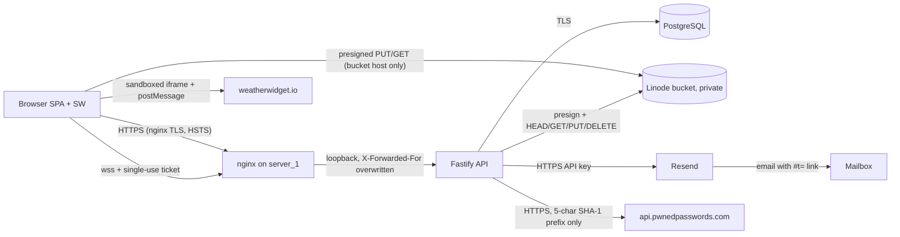

# Threat model

WP-2.3 · Security Engineer · 2026-10-06 · baseline `main` @ `28c55aa`, updated after the PR #35 review (merged with `main` @ `e75e718`)

Cuencada is a private family portal:

- **SPA:** React/Vite PWA, served by nginx.
- **API:** Fastify 5, on `server_1` behind nginx. TLS ends on the VPS; there is
  no Cloudflare.
- **Database:** PostgreSQL through Drizzle.
- **Media:** a private Linode Object Storage bucket (presigned URLs).
- **Email:** Resend.
- **Chat:** WebSockets.

The repository is public, so security can't depend on secret code. All
fixtures are fictional.

Related documents: [route inventory](routes.md), [CSP](csp.md),
[OWASP/ASVS checklist](owasp-checklist.md), [dependencies](dependencies.md).

## 1. Assets

| Asset | Where | Sensitivity |
|---|---|---|
| Contact PII: email, phone, city | `users.email`, `profiles.phone/city` | **High.** Shown in the directory only when the person enables `show*`. Admins see emails. |
| Family structure: names, parent/partner links, birth/death years, branch | `people`, `person_relationships` | **High.** Reveals who belongs to the family. Verified members only. |
| Attendance and RSVPs: who attended or is coming, guests, hotel, dates, notes | `cuencada_rsvps`, `cuencada_attendance` | **Medium–High.** Physical-presence data: someone could learn when a home is empty. Notes are visible to admins only. |
| Photos and videos (faces, places, children) | Bucket `cuencadas/<year>/…`, `media_items` | **High.** Members-only (PR #31 owner decision). Originals are stripped of GPS/EXIF and video location atoms (T4). |
| Avatars | Bucket `avatars/<userId>/…` | Medium. |
| Chat messages | `chat_messages` | Medium. Visible to members, including the sender's name and avatar. |
| Credentials | `users.password_hash` (argon2id, m = 19 MiB, t = 2) | **Critical.** |
| Session and refresh tokens | `sessions`, `refresh_tokens` (hashed); `__Secure-cuencada_rt` cookie | **Critical.** |
| One-time tokens: invites, magic links, password reset, email verification, WS tickets | `invites.token_hash`, `magic_links.token_hash` (SHA-256), WS tickets in memory | **Critical.** Hashed at rest and delivered in URL fragments (`#t=`). |
| Secrets: `JWT_SECRET`, DB URLs, S3 keys, Resend key, seed admin password | Vault and env only | **Critical.** Never in the repo. |
| Audit log | `audit_logs` (actor, action, IP, redacted metadata) | Medium. Integrity matters. |
| Member-only links (WhatsApp group, external album) | `cuencadas.whatsapp_url/external_album_url` | Medium. The legacy links are public in git history; they rotate at cutover. |

## 2. Actors

| Actor | Capabilities / intent |
|---|---|
| Anonymous Internet user | Public edition pages and auth endpoints. Scraping, credential stuffing, enumeration, DoS. |
| Holder of a leaked invite link | An open member invite shared on WhatsApp: up to 20 uses, 14 days. Can create a member account. |
| Unverified member | Copy-link or open-invite account whose email isn't verified yet. |
| Verified member | Normal family member. May be curious about others' hidden data (horizontal escalation, IDOR). |
| Disabled or removed member | Holds old tokens, cookies or tickets. |
| Admin | Trusted family organizer, the only one with full PII access. Their account is a high-value target. |
| Stolen-device or shared-computer user | Physical access to a logged-in or recently used browser. |
| Compromised third party | npm package, Resend, Linode, weatherwidget.io, GitHub Actions. |
| Operator | Deploys and runs migrations and the one-off seed. |

## 3. Trust boundaries

- **TB1, Internet → nginx → API.** Every request is untrusted. The API trusts
  `X-Forwarded-For` only from loopback (`TRUST_PROXY=loopback`).
- **TB2, API → database.** The runtime role should be least-privilege; that's
  the cutover checklist's "separate DB roles" item.
- **TB3, browser ↔ bucket.** The browser talks to the bucket directly using
  URLs the API signed: a PUT bound to type and size, and a GET that lasts 1 h.
  The API re-checks the size, content type and magic bytes, then re-encodes
  the file.
- **TB4, API → Resend → mailbox.** Tokens leave the system here. Fragments
  keep them out of logs and `Referer` headers.
- **TB5, SPA ↔ weatherwidget.io.** A cross-origin sandboxed frame with a
  validated `postMessage`.
- **TB7, API → api.pwnedpasswords.com (WP-2.3c).** The breached-password
  check sends only the first 5 hex characters of the new password's SHA-1
  (k-anonymity, `Add-Padding: true` so the answer size reveals nothing); the
  suffix is compared locally and never logged. This is the API's only
  outbound call besides Resend and the bucket, so `server_1` needs egress
  HTTPS to that host. It **fails open** (1.5 s timeout, non-200, network
  error → password allowed, `password.breach_check_unavailable` warn with a
  counter): an HIBP outage or an egress block must not stop signups and
  resets, the length policy still applies, and the counter in the logs makes
  a persistent outage visible. Calls are bounded by the routes' existing
  rate limits plus a 10-minute prefix cache. The browser never calls HIBP,
  so the CSP is unchanged.
- **TB6, CI/supply chain.** GitHub Actions pinned by SHA, the pnpm lockfile,
  `minimumReleaseAge`.

## 4. STRIDE per component

Each row lists the main mitigation and where it's enforced or tested.
**Bold** marks items that are open or were fixed in WP-2.3.

### 4.1 Authentication and sessions (`modules/auth`, `plugins/auth.ts`)

| Threat | Mitigation | Evidence |
|---|---|---|
| **S**: credential stuffing or spraying | argon2id. Credential limits: 10 per IP+email, 20 per IP, 10 per email, each per 15 min. A dummy verify equalizes timing. Generic `INVALID_CREDENTIALS`. | `lib/rateLimit.ts`, `sessionRoutes.test.ts`, `passwordRoutes.test.ts` |
| **S**: stolen access token | 15-min HS256 JWT (`iss`/`aud`/alg pinned). The guard loads the session **and** the user from the DB on every request, so revocation, disabling and demotion take effect at once. | `plugins/auth.ts`; matrix rows "disabled", "revoked": [`authz-matrix.test.ts`](../../apps/server/src/__tests__/security/authz-matrix.test.ts) |
| **S**: stolen refresh token | HttpOnly, Secure, SameSite=Strict cookie with `Path=/api/auth`. Single-use rotation; reuse after the 10 s grace revokes the whole session. Idle 30 d / absolute 90 d. | ADR 0001 §3, `sessionRoutes.test.ts` |
| **T/S**: CSRF on cookie routes | `X-Cuencada-CSRF: 1` plus an exact `Origin` allowlist. Every other route needs a bearer token. | matrix "cookie routes" block (6 header variants → 403 `CSRF_FAILED`) |
| **R**: denial of account actions | `auth.*` audit rows with IP. Refresh races and reuse are audited. | `lib/audit.ts` |
| **I**: account enumeration | Request endpoints always return 202. Login errors are generic and timing-equalized. Invite inspect returns a masked email. | `emailRoutes.test.ts`, `invites.test.ts` |
| **I**: tokens in logs or `Referer` | Tokens travel in the body or `#t=` fragment. The logger redacts query params through an allowlist, and redacts keys recursively. | `logging.ts`, `logging.test.ts` |
| **I**: cached PII or tokens on a shared computer | **WP-2.3 M1 (fixed): every `/api/` response is `Cache-Control: no-store`.** The SW never caches private API responses (T9) and purges on logout. | [`headers.test.ts`](../../apps/server/src/__tests__/security/headers.test.ts), `check:sw` |
| **E**: temporary password reused for everything | `must_change_password` → 403 `PASSWORD_CHANGE_REQUIRED` everywhere except `/me` and change-password. | matrix column "pending" |
| **E**: unverified account reading PII | `requireVerifiedEmail` on the directory, family, attendees, chat, **the gallery and every media route, and the member edition details (WhatsApp/album links)** → 403 `EMAIL_UNVERIFIED`. The media and member-details gating was WP-2.3 L2 (Medium, fixed by owner decision). Still open to unverified members: announcements, the RSVP summary (counts only), their own RSVP, profile and avatar, and `/me`. | matrix column "unverified"; [`verified-gating.test.ts`](../../apps/server/src/__tests__/security/verified-gating.test.ts); ADR 0001; residual risk A4 |
| **S**: account takeover with a password known from other breaches | **WP-2.3c (L5 fixed):** invite accept, change-password and reset-password reject passwords seen in breaches (HIBP k-anonymity, TB7) before hashing; fail-open by design. | `breachedPasswords.test.ts`, `breachedPasswordRoutes.test.ts` |
| **D**: email or argon2 flooding | Per-recipient mail budget (1 per 2 min per purpose, 3/h, 10/day). Global daily cap of 300 plus a reserved 100. Global limit of 300/min per IP. | `mailBudget.ts`, `mailSafety.test.ts` |

### 4.2 Invites and onboarding (`modules/invites`)

| Threat | Mitigation | Evidence |
|---|---|---|
| **S**: invitee claims someone else's identity | Bound invites compare the typed email with the bound one. Admin invites must be email-bound, single-use and sent by email. `emailVerified` is granted only for email-delivered bound invites. | ADR 0001 §3, `invites.test.ts` |
| **E**: open invite leaks beyond the family | Max 20 uses and 14 days. An admin can revoke it. New accounts start unverified: they read only public pages, announcements, the RSVP summary and their own data until they verify. **Verification is not a membership check:** a stranger holding a leaked link can verify their **own** mailbox, and from then on read every member-only area (directory, family tree, attendees, chat, gallery, member links). **Planned (separate WP):** stricter open invites, with a default of about 5 uses, a 72 h lifetime and an admin alert on each acceptance, so a leak is short-lived and noticed. | accepted risk A2 |
| **T**: double use of a single-use invite | Row lock (`FOR UPDATE`) on accept. | `invites/publicRoutes.ts` |

### 4.3 Directory, profile and family (`modules/directory`, `profile`, `family`)

| Threat | Mitigation | Evidence |
|---|---|---|
| **I**: hidden contact fields leak | `toDirectoryEntry()` omits fields whose `show*` flag is off. The response schemas strip unknown keys and fail closed on `null`. Search matches only visible fields. | ADR 0001 §2; [`pii-leak.test.ts`](../../apps/server/src/__tests__/security/pii-leak.test.ts) (directory, family) |
| **I**: unlisted members discovered | Directory 404 for unlisted members. The family tree nulls `userId`/`avatarUrl` for unlisted people. | matrix IDOR on `GET /api/directory/:id`; `pii-leak.test.ts` |
| **T/E**: editing someone else's profile or tree node | Self-scoped routes (`/profile/me`, `/family/me`) have no id in the path, and zod strips unknown keys: a self-edit carrying `fullName`/`userId`/`deceased`/`id`, or an RSVP naming another `userId`, changes nothing it must not (matrix mass-assignment probes). Tree edits are admin-only. The `parent_of` cycle check runs under an advisory lock. | matrix |
| **T**: avatar upload abuse | Presigned PUT bound to type and size. Magic bytes are checked. sharp decodes with a 24 MP cap and re-encodes to WebP. Confirm is owner-only. | matrix IDOR on avatar confirm; `avatar.test.ts` |

### 4.4 Media (`modules/media`)

| Threat | Mitigation | Evidence |
|---|---|---|
| **I**: photos reachable without login | Private bucket. Short-lived presigned GETs (1 h) are issued only to **verified** members. There are no public URLs. Stored objects carry `Cache-Control: private, max-age=3600` (WP-2.3 N1; it was a year, `immutable`), so a photo stays in a shared browser's disk cache for at most about an hour after logout. | `media/list.test.ts`, `pii-leak.test.ts`, `verified-gating.test.ts`, `cache-lifetimes.test.ts` |
| **I**: location metadata in uploads | EXIF/GPS stripped by re-encoding. MP4/QuickTime location atoms are neutralized. | `files.test.ts`; open item: non-A/V tracks (backlog) |
| **T**: malicious file (polyglot, decompression bomb, wrong type) | MIME allowlist (no SVG or HEIC), per-kind size limits, magic-byte check, 50 MP guard, server-side derivatives. Stored on the bucket's own origin, which has no cookies. | `upload.test.ts`; backlog: `nosniff` metadata on stored QuickTime |
| **E**: editing or deleting others' media; confirming others' uploads | Uploader-or-admin checks answer 404. Hidden, pending-review, pending-upload, processing and failed items are visible only to the uploader and admins. A member can't report their own item (403). | matrix probes on `/api/media/:id*`, which re-read the row and assert it is unchanged |
| **D**: storage exhaustion | 50 pending intents per user (5 for avatars), a daily byte budget, per-user rate limits, cleanup of stale intents. | `media/routes.ts`, `mediaCleanup.test.ts` |

### 4.5 Chat (`modules/chat`)

| Threat | Mitigation | Evidence |
|---|---|---|
| **S**: cross-site WebSocket hijacking | 30 s single-use ticket from `POST /api/chat/ticket` (bearer-authenticated, verified members only), bound to the session. Exact `Origin` check. Failures close with 1008 and a generic reason. | matrix "chat WebSocket upgrade"; `socket.test.ts` |
| **E**: revoked or disabled user keeps the socket | The ticket re-checks the session. Sockets close on revoke or disable, and a 5-minute session re-check runs. | `socket.test.ts`, `chatSockets.test.ts` |
| **T**: XSS through message bodies | Bodies are stored and rendered as text nodes only. Bidi and invisible characters are stripped. No markdown. | ADR 0001 §1, T7-FE |
| **I**: ticket in logs | Query `ticket` is redacted in app logs. nginx must strip it from access logs (cutover checklist). | `logging.test.ts` |
| **D**: flooding | 20 sends and 60 frames per 10 s per user, a frame-size cap, queue backpressure, a connection cap. | `socket.test.ts`, `capacity.test.ts` |

### 4.6 Admin console (`modules/admin`, admin routes of every module)

| Threat | Mitigation | Evidence |
|---|---|---|
| **E**: member reaches admin routes | `auth: "admin"` checks the **database** role, so forged claims don't help. All 45 admin routes deny members with 403. | matrix (45 rows); `inventory.test.ts` fails on any unclassified new route |
| **E**: admin locks out the last admin, or self-escalates | Self-change is forbidden. There's a last-admin guard and a limit of 3 role/status changes per target per hour. Admins can't verify their own email. | `userRoutes.test.ts` |
| **R**: admin abuse | Every mutation writes an audit row with redacted metadata. Admins are alerted on role and status changes. | `adminAlerts.test.ts`, `auditRoutes.test.ts` |
| **I**: secrets in admin views | No hashes, tokens, object keys or PUT URLs in admin bodies. CSV exports neutralize formulas. | `pii-leak.test.ts` (admin block), `csv.test.ts` |

### 4.7 PWA and SPA (`apps/web`)

| Threat | Mitigation | Evidence |
|---|---|---|
| **T**: XSS | React text rendering, no `dangerouslySetInnerHTML`, admin links `https://`-only and canonicalized. Strict CSP with no inline script or style and no third-party script. | [`csp.md`](csp.md) (Chromium run: 0 unexpected violations) |
| **I**: access token theft | The access token lives in memory only, never in storage. The refresh token is in an HttpOnly cookie. | T1-FE |
| **I**: private data in the SW cache | The SW caches only PII-free public edition reads (NetworkFirst) and purges on logout. CI runs `check:sw`. | T9 |
| **T**: clickjacking | `frame-ancestors 'none'` and `X-Frame-Options: DENY`. | `headers.test.ts`, `csp.md` |
| **T**: stale client after a breaking API change | Open: minimum-client-version mechanism (backlog, WP-2.x). | |
| **I**: weather widget | Cross-origin sandboxed iframe (`allow-scripts allow-same-origin allow-popups`), `postMessage` with an explicit origin, numeric height only. | WP-0.4 embed contract |

### 4.8 Email (`lib/mailer`, `packages/emails`)

| Threat | Mitigation | Evidence |
|---|---|---|
| **S**: phishing lookalikes | Links always point to `APP_BASE_URL` with a `#t=` fragment. Reply-To is `SUPPORT_EMAIL`. No user-controlled URLs in templates. | `packages/emails` tests |
| **I**: token exposure | Tokens are single-use and short-lived (login 15 min, reset 30 min, verify 24 h) and hashed at rest. A GET does nothing, so link scanners can't consume them. | `emailTokens.ts` |
| **D**: abuse of Resend quota | Recipient budget, global daily cap, admin alerts that bypass the cap. | `mailBudget.ts` |
| **R**: send failures go unnoticed | Queue retries. `mail.cap_reached` and `mail.queue_full` are logged. Open: alert on them (backlog). | |

## 5. Accepted risks (owner and orchestrator decisions)

| # | Risk | Decision | Owner |
|---|---|---|---|
| A1 | The **legacy public site** (`index.html`, `cuencada2026.html`, root `images/`) stays public until cutover. It carries the old WhatsApp and OneDrive links, and git history keeps them. | Retire at cutover. Rotate the WhatsApp and OneDrive links. "Sweep forward, no history rewrite" (cutover checklist). | Repo owner |
| A2 | **Open invites shared through WhatsApp:** anyone the link reaches can create an account, verify their own mailbox, and then read every member-only area. Email verification does not limit this. | Accepted for now, with these mitigations: limits of 20 uses and 14 days, admin revoke, accounts that start unverified (no PII until they verify), the admin audit log, and admins can disable a stranger's account. **Planned mitigation (separate WP):** default about 5 uses, 72 h lifetime, an admin alert on each acceptance. | Owner / orchestrator (ADR 0001) |
| A3 | **Chat author visibility:** a member unlisted from the directory still shows their name and avatar in chat. | Accepted. Help text tells members (backlog 0.8c T5-FE). | Orchestrator (T7) |
| A4 | **Unverified members** can still read announcements and the RSVP summary (counts only, no names). | **Decided** (owner, WP-2.3 L2, now fixed): the gallery, every media route and the member edition details are gated with `requireVerifiedEmail` (ADR 0001). Announcements and the summary stay open by decision. | Owner |
| A5 | **Refresh race window:** a token stolen and replayed within 10 s of the victim's own refresh gets 409, not a revocation. | Accepted (ADR 0001, T1). | Orchestrator |
| A6 | **HS256 shared secret** for access tokens (a single service). | Accepted. A secret of ≥ 32 chars from vault; rotating it logs everyone out. | Tech Lead |
| A7 | **No CAPTCHA** on public auth endpoints. | Accepted. IP and email rate limits plus mail budgets. Revisit if abuse shows up. | Tech Lead |
| A8 | sharp's prebuilt **libvips is LGPL-3.0-or-later**. | Accepted. Dynamically linked, unmodified and used server-side only, so no distribution obligation applies. | Tech Lead |
| A9 | **Media in the browser cache:** after a logout, photos and avatars fetched through presigned URLs can stay in the browser's HTTP cache. | Bounded (WP-2.3 N1, fixed): stored objects carry `private, max-age=3600`, no longer than the presigned GET, instead of a year with `immutable`. The residual hour is accepted. Objects stored before the change keep their old metadata (there is no production bucket yet). | Tech Lead |

## 6. Open items

These come from [`backlog.md`](../coordination/backlog.md), plus the WP-2.3 findings.

**Cutover (WP-2.4/2.5):**

- nginx CSP and headers ([csp.md](csp.md)).
- `X-Forwarded-For $remote_addr`, and ignore `CF-Connecting-IP`.
- Redact `?ticket=`, `?q=` and `?search=` from access logs.
- Restrict `/health*` to localhost or monitoring.
- Separate DB roles.
- Rotate the WhatsApp and OneDrive links.
- Real-bucket PUT enforcement check and bucket CORS.
- Memory limits for the 300 MB video path.

**Backend:**

- `nosniff` metadata on stored QuickTime objects.
- Neutralize non-A/V tracks (GPS in GoPro/drone telemetry).
- E.164 phones.
- Streamed storage I/O.
- `incoming/` prefix plus a lifecycle rule for orphaned objects.
- Ping re-check of session and user status.

**Web:**

- `z.config({ jitless: true })` (WP-2.3 L1).
- Privacy sweep inside `features/**`.

**Before launch:**

- ~~Breached-password check (WP-2.3 L5).~~ Done in WP-2.3c; needs egress HTTPS to `api.pwnedpasswords.com` from `server_1` (cutover checklist).
- Stricter open invites: about 5 uses, 72 h lifetime, an admin alert on each acceptance (separate WP; accepted risk A2).

**Process:**

- A lint rule against PII in `Error` messages.
- Minimum client version.
- Alerts on mail caps.

**WP-2.3 findings:** see [`backlog.md` → WP-2.3 findings](../coordination/backlog.md#wp-23-findings).
